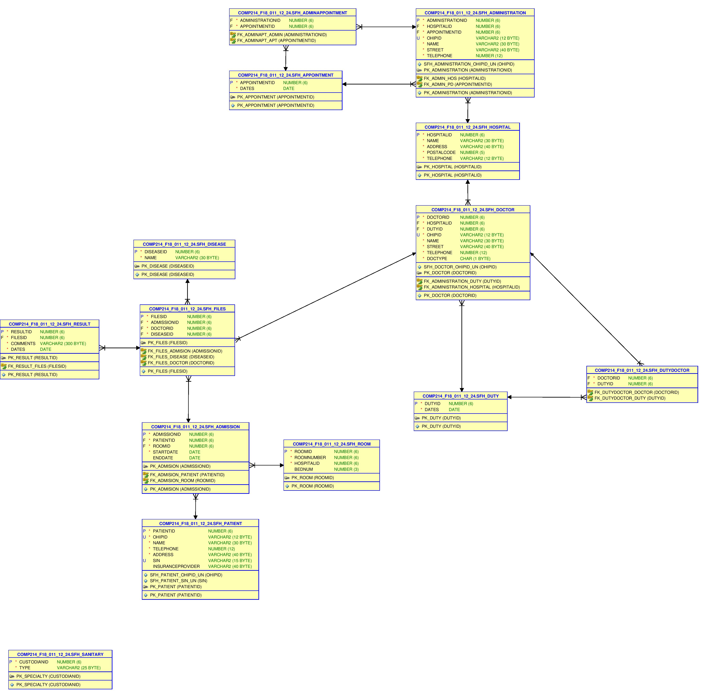

# SpringFieldHospital-Database
Term Project for Database

Spring Field hospital database is PL/SQL project which can keep the track record for hospital. started from scratch, the project required creating tables, filling them with data, deleting and editing data as required and updating it. Procedures, triggers, functions and views were created to ensure that accessing data and creating a table report becomes easy 

Following are the data tables:
Room Table
Patient Table
Hospital Table
Disease Table
Appointment Table
Duty Table
Speciality Table
Admission Table
Doctor Table
Files Table
Result Table
Administration Table
Admin Appointment Table
Doctor Duty Table
-------------------------
Procedures:

- Procedure to get the history of patient
- Procedure to discharge a patient or show error if already discharged
- Procedure that shows analysis of diseases id enteredProcedure to show the patient name and bed 
number based on diseases id
-------------------
Functions:

- Function to see how many times a given patient was admitted
- Function to return Number of free bed available in hospital
-------------------
Views:

- Number of Doctors per Hospital
- Total Patient Treated in one month
- Number of Duty Performed by each employee in One Month
- History for patients
- Number of beds Available per each room.
- Number patient per doctor
--------------------
Triggers:
- Start date must be earlier than end date
- Patient's Result must be Assigned to File

## ERD 
 
